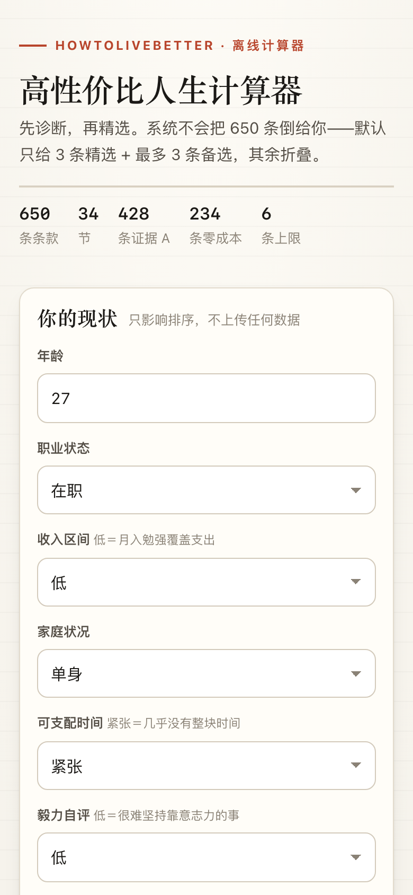

# 高性价比人生计算器

**一个 HTML 文件装下一本 650 条的书，双击就能用的「决策顾问」小工具。**

输入现状 → **先诊断** → **精选 Top 3 行动建议** → 最多 6 条 → 其余折叠。
基于开源书稿《高性价比人生指南》650 条条款的成本收益数据做规则排序。

**双击 `index.html` 就能用。** 零后端、零模型、零依赖、零网络请求。


---

## 🐣 小白使用指南（不懂技术也能用）

**这个应用只有一个文件：`index.html`。** 不需要安装任何东西，不需要联网，不需要命令行。

### Mac 用户
1. 找到 `index.html` 这个文件。
2. **双击它**，就会用 Safari（或你默认的浏览器）打开。
3. 如果双击后是用「文本编辑」打开的：右键点文件 → 打开方式 → 选 **Safari** 或 **Chrome**。
4. 想换个浏览器：右键 → 打开方式 → Google Chrome。

### Windows 用户
1. 找到 `index.html` 这个文件。
2. **双击它**，就会用 Edge（或你默认的浏览器）打开。
3. 如果图标显示成记事本、双击弹出代码：右键点文件 → 打开方式 → 选 **Microsoft Edge** 或 **Google Chrome**。
4. 想以后都双击打开：勾选「始终使用此应用打开 .html 文件」。

### 手机 / 平板能看吗
能。文件本身就是自适应布局的（页面宽度窄的时候会自动变成单列）。
把 `index.html` 传到手机上，用「文件」App（iOS）或「文件管理」（Android）点开即可。

### 怎么发给别人
**只用发 `index.html` 这一个文件。** 微信、邮件、U 盘、网盘都行，不需要打包、不需要附带任何其他文件。
对方收到后双击就能用，看到的界面和数据和你完全一样。

> 小提示：文件有 1.7 MB，因为 650 条建议的正文、成本、证据等级和原始出处全都打包在里面了。
> 这是正常的，它就是「一个文件装下整本书的计算器」。

### 它会不会偷偷联网 / 上传我的输入
不会。可以自己验证：打开页面后按 F12 → Network（网络）面板 → 刷新页面，
你会看到**只有 `index.html` 这一个请求**，没有任何外部请求。
所有计算都在你自己的浏览器里完成，输入的内容不会离开这台电脑。

---

## 交互模型（从「罗列清单」改成「决策顾问」）

| 阶段 | 行为 |
| --- | --- |
| 1. 诊断 | 顶部生成【现状诊断】：核心矛盾 + 性价比策略 + 3 条行动启示（逐字取自原书，附节号条号） |
| 2. 精选 | **精选 Top 3**：只从「命中你的困惑关键词或关心领域」的条款里挑，先比命中几个词条，再比加权总分 |
| 3. 备选 | 再补 3 条纯按性价比排上来的，凑满 **6 条硬上限** |
| 4. 折叠 | 其余进 `展开查看其他相关建议（共 X 条）`，点开分批渲染（每批 60 条），可随时收起 |
| 5. 出处 | 每张卡片**始终显示**「第 X 节 · 第 Y 条 · 章节名」；完整原文出处放在展开详情里 |

卡片默认只给：**行动高亮行 + 标题 + 性价比 + 证据等级 + 命中标签 + 节号条号**。
正文全文、依据、备注、成本仪表（钱/时间/毅力）、完整出处、打分明细都在「展开详情」里。

## 文件说明

| 文件 | 作用 |
| --- | --- |
| `index.html` | **交付物**。单文件应用：内联 HTML + CSS + JS + JSON，1.7 MB，`file://` 直开 |
| `parse.js` | 解析脚本。`src/book/NN-*.md` → 结构化 JSON → 注入模板生成 `index.html` |
| `src/template.html` | 页面模板（含 `/* __DATA_BEGIN__ */` 数据占位） |
| `src/book/*.md` | 34 节 markdown 原文（650 条条款） |
| `data.json` | 中间产物，便于排查数据或做别的应用 |
| `test.js` | 引擎单元测试（84 项）。**直接从 `index.html` 抽代码跑**，测的就是页面里那份实现 |
| `e2e_cdp.py` | 端到端验收（49 项）。CDP over pipe 驱动 Chromium，只用 Python 标准库 |
| `shot-*.png` | 验收截图：桌面表单、诊断+精选、押金场景、移动端 |

## 运行与验证

```bash
# 1) 直接用浏览器打开（这就是离线验证）
open index.html          # macOS；Windows 直接双击，Linux: xdg-open index.html

# 2) 引擎与规则测试（84 项）
node test.js

# 3) 真机验收：file:// 打开 + 模拟点选 + 抓网络请求 + 出截图（49 项）
python3 e2e_cdp.py
```

`e2e_cdp.py` 会打印这几行作为**离线证明**：

```
页面地址：file://…/index.html（本地文件直接打开）
网络请求总数：1，其中外部请求：0
  · file://…/index.html
  ✓ 离线可用：没有任何外部网络请求
```

## 换成真实 / 更新的数据

数据已经是从上游仓库真实解析出来的（650 条，34 节），不是示例数据。

```bash
# 书稿原文是第三方 CC BY 4.0 内容，没有放进本仓库，一条命令拉回来即可
git clone --depth 1 https://github.com/eternity4719/HowToLiveBetter tmp
mkdir -p src/book && cp tmp/book/*.md src/book/ && rm -rf tmp
node parse.js                # 重新解析 + 重新生成 index.html
```

`parse.js` 依赖 markdown 里的固定结构：

```markdown
# 15. 租房与买房                       ← 一级标题 = 章节
### 1. 押金必须写进合同                 ← 三级标题 = 建议标题（也是行动句的来源）
<!-- 成本标签: 钱=0 时间=少 毅力=些 收益=中 口径=金钱 -->
- 成本：不花钱。签合同时多花十分钟。
- 说人话：押金多少、什么时候退……      ← 正文
- 收益：行政法规写得很明白……          ← 依据
- 证据等级：A
- 来源：国务院 (2025). 住房租赁条例……
- 备注：退租那天和房东一起拍照录像……
```

输出记录（`gain / cost_note / note / lens / action_*` 是 UI 增强字段，**不参与排序**）：

```json
{
  "id": "15-01", "section": 15, "section_name": "租房与买房", "index_in_section": 1,
  "title": "押金的数额、退还时间和扣减情形，必须写进合同",
  "cost_money": 0, "cost_time": 0, "cost_grit": 1,
  "benefit_level": "中", "evidence": "A",
  "source": "国务院 (2025). 住房租赁条例……", "body": "押金多少、什么时候退……",
  "action_tag": "防坑红线", "action_text": "必须写进合同",
  "gain": "……", "cost_note": "……", "note": "……", "lens": "金钱"
}
```

成本档位映射：`钱 0/少/多 → 0/1/2`，`时间 少/中/多 → 0/1/2`，`毅力 否/些/是 → 0/1/2`。

### 行动高亮行怎么来的

`action_tag` / `action_text` 是**从原书原文里逐字挑的**，不生成新句子：

- 候选来自标题、「说人话」正文；候选必须**以动词开头**（先/别/不要/要/把/立刻/定期/每天/记得/务必/…），
  并剔除半截话（以「的 / 了 / 概率 / 问题 / 试验」等结尾）、法条原文、统计口径（`万人`、`%`）、
  方向会反的相对风险句（`每天多…`、`越多…`）。挑不出来时退回标题里最像动作的那个从句。
- `action_tag` 按章节名 + 正文线索分成 6 类：防坑红线 / 应急动作 / 健康行动 / 省钱兜底 / 办事清单 / 行动建议。
- **防幻觉硬约束**：`test.js` 断言 650 条 `action_text` 全部是 `title/body/gain/note/cost_note` 里
  连续出现的子串，平均 13 字，最长 27 字。页面上还会做一次展示层优化：若行动句正好是标题开头，
  就改显示标题冒号后面那半句（例如「先把门槛对一遍：十二条路的年龄和学历要求…」→ 显示后半句），
  避免和标题重复，内容仍是原文子串。

## 排序口径

### 1. 性价比（纯函数，与规格逐字一致）

```js
function calcRatio(benefitLevel, costMoney, costTime, costGrit) {
  const costScore = costMoney + costTime + costGrit;
  if (benefitLevel === '大' && costScore === 0) return '极高';
  if (benefitLevel === '大' && costScore <= 2) return '高';
  if (benefitLevel === '中' && costScore === 0) return '高';
  return '一般';
}
```

档位分：`极高 = 3`，`高 = 2`，`一般 = 1`。192 种参数组合已在 `test.js` 里穷举比对。

### 2. 加权总分（决定「备选」和完整排序）

| 规则 | 加分 |
| --- | --- |
| 基础分 | 性价比档位分（3 / 2 / 1） |
| 收入低 且 `cost_money = 0` / `= 1` | +2 / +1 |
| 时间紧张 且 `cost_time = 0` / `= 1` | +2 / +1 |
| 毅力自评低 且 `cost_grit = 0` | +1 |
| 章节命中关心领域（手选 ∪ 由职业/家庭/年龄推导） | +3（命中多个也只加一次） |
| 困惑词命中标题或正文 | 每词 +1，**上限 +3** |
| 证据等级 A / B / C | +1 / +0.5 / +0 |

排序：**总分降序 → 同分时性价比档位高者优先 → 证据等级高者优先**。
每张卡片的「为什么排在这里」列出该条的每一笔加分，可手算复核。

### 3. 精选 Top 3 的排序（在上面总分之外，另外加两条规则）

- **词条命中优先**：把用户写的话按标点切成「词条」，并把诊断出的意向同义词（例如「考研」→
  读研/留学/学历/研究生/考公…）一起作为检索词条。**一个词条命中就算一次**，不会因为切成 4 个
  二字词就变成 4 次。精选先比命中词条数，再比加权总分。
- **阶段一致性降权**：自称「在职」又没提失业的人，被推「失业金怎么领」是没读题。
  这类条款的相关性 −1（**只影响精选顺序，不改加权总分、不删除条目**），仍完整保留在备选与「其余」里。
- 用户没写困惑时，**不做意向词扩展**（否则「健康」会扩成 生病/住院/失眠…，把不相干的条款顶上来），
  此时精选退回「领域命中池 + 总分排序」。

### 4. 诊断口径（规则拼装，无模型）

- 意向匹配顺序：**先只看「一句话困惑」** → 再看职业/家庭 → 最后只看用户**自己勾选**的领域。
  （隐含领域如「在职→职业」「已婚→婚育」不参与诊断叙事，避免对着在职的人说「你在考虑换轨」。）
- 从困惑读出来的矛盾，才允许下断言（「想用学历提升职业天花板，但要先算清脱产期间的现金流与社保断档」）；
  只从领域猜出来的，用温和表述（「你把健康列为关注点，但还没说具体症状」）。
- 不编造用户的具体数字：诊断文字里不会出现「你有 15 万存款」这类你没有输入的信息。
- 页面上会显示**诊断依据**（困惑/职业家庭/领域/权重）与**规则命中**了哪几个意向，
  以及**为精选扩充的检索词**，方便核对它是怎么得出结论的。

## 防幻觉的三条硬约束

1. 行动高亮行 100% 是原书原文子串（`test.js` 全量断言）。
2. 诊断文字来自固定模板表，只做变量替换，不生成新事实；引用条款时附带节号条号。
3. 每张卡片强制显示「第 X 节 · 第 Y 条」，完整出处就在展开详情里；页面底部固定挂免责声明：
   > 排序结果是基于原书成本收益数据的计算工具，不是医疗/法律/财务诊断。请点击卡片中的原书出处，核对原文后再做决定。

页面底部还有一行状态提示（同时输出到控制台）：`修改完成，已强制限制为 Top 6 建议`。

## 界面




## 数据来源与许可

**代码**（`index.html` 里的页面逻辑与样式、`parse.js`、`src/template.html`、`test.js`、`e2e_cdp.py`）
按 [MIT](LICENSE) 授权，随便用。

**条款内容**（建议正文、成本标签、证据等级、原始出处，以及内联进 `index.html` 的 650 条数据）
来自开源书稿 [eternity4719/HowToLiveBetter](https://github.com/eternity4719/HowToLiveBetter)，
作者 eternity4719，按 **CC BY 4.0** 使用，转载与引用请保留署名。
书稿原文 `book/*.md` 没有放进本仓库，用上面的命令可以拉回来。

> 本工具只做成本收益排序，**不构成医疗 / 法律 / 财务建议**。
> 涉及健康、法律、金钱的决定，请回到每张卡片里的原始出处自行核对。
